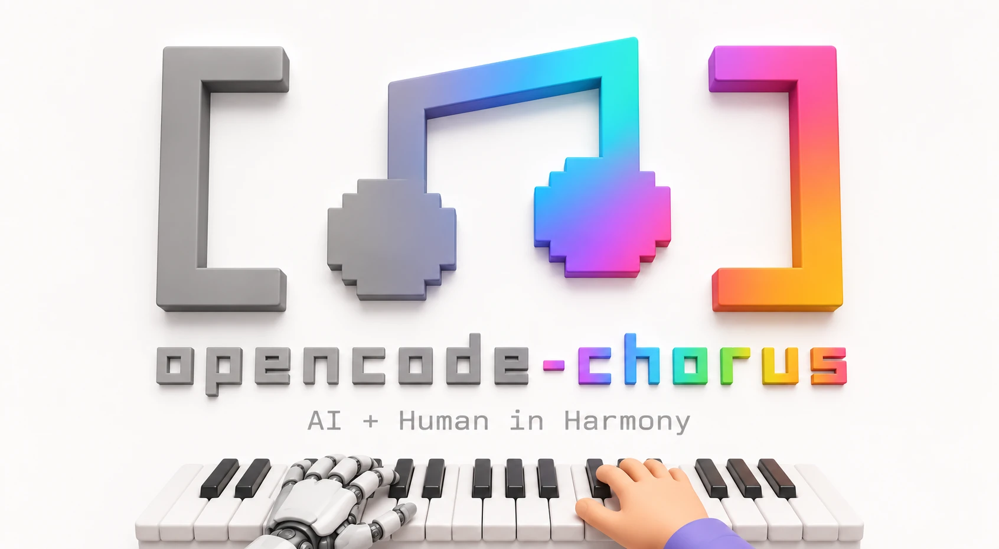

<div align="center">



# opencode-chorus

> The [Chorus](https://github.com/Chorus-AIDLC/Chorus) integration plugin for [OpenCode](https://opencode.ai)

[](https://www.npmjs.com/package/opencode-chorus)
[](./LICENSE)
[](https://opencode.ai)

</div>

---

## What Is This?

[**Chorus**](https://github.com/Chorus-AIDLC/Chorus) is an agent harness for AI-Human collaboration, inspired by the [AI-Driven Development Lifecycle (AI-DLC)](https://aws.amazon.com/blogs/devops/ai-driven-development-life-cycle/) methodology. It manages session lifecycle, task state, sub-agent orchestration, observability, and failure recovery — letting multiple AI agents and humans collaborate through the full workflow from requirements to delivery.

**opencode-chorus** is the community-maintained plugin that connects [OpenCode](https://opencode.ai) to your Chorus instance. It loads Chorus workflow skills, exposes a lazy MCP tool bridge, and provides lifecycle hooks and reviewer automation — all without manual tool or skill configuration.

## Features

| Category | Components | Description |
|---|---|---|
| **Lifecycle Hooks** | State Management, Lazy MCP Bridge, Context Injection, Notification Coordination | Manages state, discovers Chorus tools on demand, injects project context, and routes notifications. |
| **Review Agents** | Proposal Reviewer, Task Reviewer | Automated reviewers that evaluate proposals and verify completed tasks with structured verdicts. |
| **Workflow Skills** | 8 bundled skills covering the full AI-DLC pipeline | `chorus`, `chorus-idea`, `chorus-proposal`, `chorus-develop`, `chorus-quick-dev`, `chorus-review`, `chorus-yolo`, `chorus-openspec` |

> [!NOTE]
> A local or online Chorus instance must be running and accessible to use this plugin. See [Chorus Quick Start](https://github.com/Chorus-AIDLC/Chorus#quick-start) to get one running.

For detailed component descriptions, see [docs/COMPONENTS.md](./docs/COMPONENTS.md).

## Quick Start

> [!TIP]
> This plugin is already included in the [Chorus upstream onboarding flow](https://github.com/Chorus-AIDLC/Chorus#connect-ai-agents). If you followed the Chorus setup guide for OpenCode, you can skip to step 2.

### 1. Install the Plugin

Add `opencode-chorus` to your OpenCode config file (usually `~/.config/opencode/config.json`):

```json
{
  "$schema": "https://opencode.ai/config.json",
  "plugin": ["opencode-chorus"]
}
```

### 2. Configure Credentials

Create a `chorus.json` in your OpenCode config directory (`~/.config/opencode/chorus.json`) with the minimal configuration:

```json
{
  "chorusUrl": "http://localhost:3000",
  "apiKey": "your-chorus-api-key"
}
```

Or use environment variables:

```bash
export CHORUS_BASE_URL="http://localhost:3000"
export CHORUS_API_KEY="your-chorus-api-key"
```

### 3. Restart OpenCode

After installing and configuring, restart OpenCode. You will see the bundled Chorus skills in your workspace. Load the `chorus` skill to get started.

For all configuration options (environment variables, `chorus.json` fields, state storage, observability settings), see [docs/CONFIGURATION.md](./docs/CONFIGURATION.md).

## Documentation

| Document | Description |
|---|---|
| [Configuration](./docs/CONFIGURATION.md) | Full configuration reference — env vars, `chorus.json`, state storage, observability |
| [Components](./docs/COMPONENTS.md) | Detailed descriptions of lifecycle hooks, review agents, and workflow skills |
| [Changelog](./docs/CHANGELOG.md) | Release history and migration notes |

## License

[AGPL-3.0](./LICENSE)
